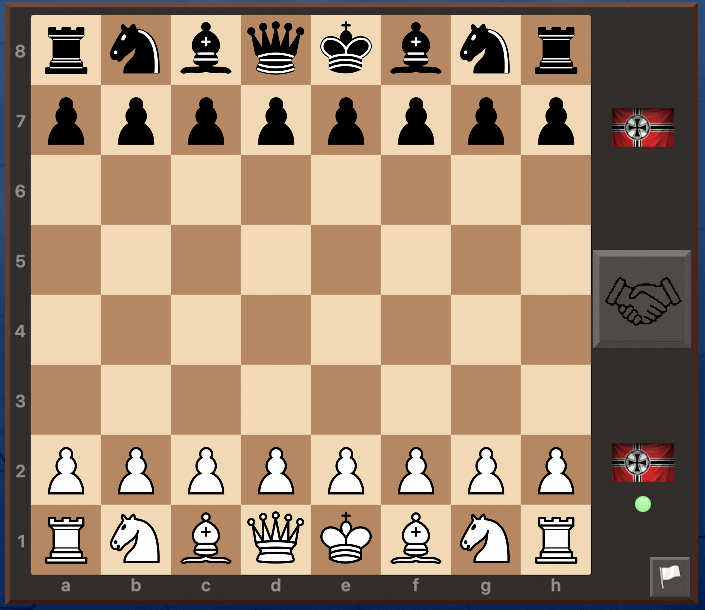
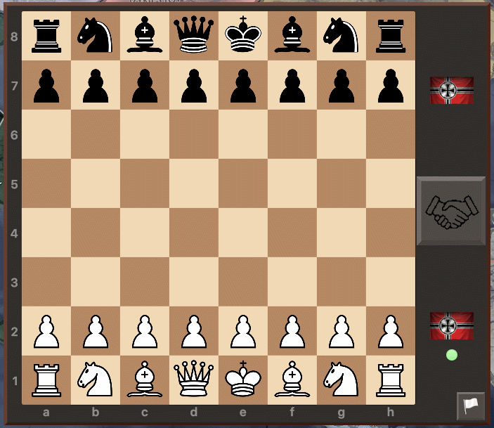

# HoI4-War-Chess
A HoI4 mod implementating a singleplayer / multiplayer chess in the game

## Features
* Play alone (Or with your coop buddy)
* Join a pool and challenge other human player in your multiplayer game

## Rules implemented
* En passant pawn capture
* Castling
* Draws
  * Stalemate : No legal move but the king is not in check
  * Lack of material : Not enough material to do a checkmate
  * 50 moves rules : More than 50 moves without moving a pawn or taking a piece will end the game with a automatic draw
  * Agreement : The player playing can send a draw request to the opponent
* Resign

## Things to add

* A timer based on the game date
* Display the pieces / pawns captured
* Display the avantage in material
* An interface with the states of all players in the games (Number of victory, draw and defeats)

## Links

[Steam workshop](https://steamcommunity.com/sharedfiles/filedetails/?id=2936449085)

## Footnotes

I am no chess player, my typical game is something like this :

